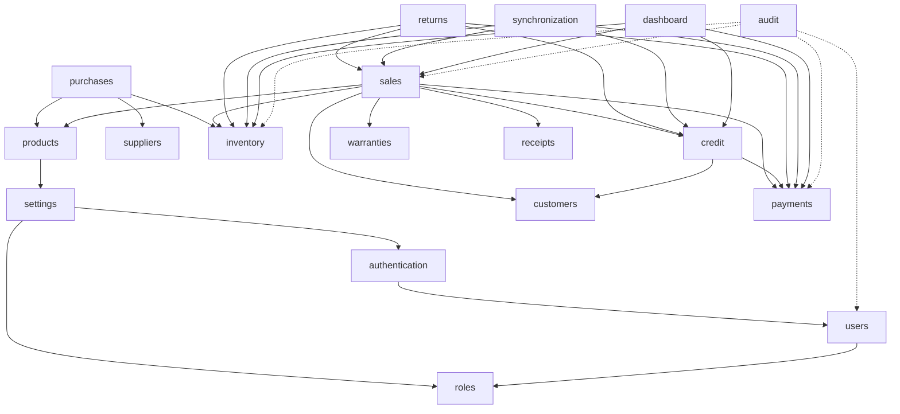

# 04 — Modules de domaine et frontières

## 1. Liste des domaines MVP

| Domaine | Responsabilité | Ne fait pas |
| --- | --- | --- |
| `authentication` | Login, session, logout, hash mots de passe | RBAC métier détaillé |
| `users` | Comptes utilisateurs | Permissions catalogue |
| `roles` | Rôles + liaison permissions | UI navigation |
| `settings` | Magasin, seuils remise, délais retour, numérotation | Règles de vente |
| `brands` / `categories` | Référentiels catalogue | Prix / stock |
| `products` | Produits, variantes, SKU, flag sérialisé | Mouvements stock |
| `suppliers` | Fiches fournisseurs | Réception |
| `purchases` | PO + réceptions | Calcul stock « magique » sans mouvement |
| `inventory` | Mouvements, devices, soldes dérivés/cache | Vente |
| `customers` | Fiches clients | Crédit (solde) |
| `sales` | Panier → vente completed | Encaissement isolé |
| `payments` | Transactions monétaires | Création stock |
| `credit` | Comptes crédit, échéances, statuts MVP | POS UI |
| `returns` | Retours / refunds / échanges | Garantie longue |
| `warranties` | Garanties liées vente/device | Atelier réparation |
| `receipts` | Génération / données reçu | Paiement |
| `dashboard` | Agrégations lecture ; CA net = encaissements − remboursements (`Africa/Douala`) ; créances = soldes hors `PAID`/`CANCELLED` (**inclut `DEFAULTED`**) | Écritures métier |

| `audit` | Journal append-only | Business rules |
| `synchronization` | Ingestion offline idempotente | UI catalogue |

---

## 2. Règles de frontières

1. **Inventory** est le seul domaine qui **écrit** des `StockMovement` (les autres demandent un service inventory).
2. **Payments** enregistre toute entrée/sortie d’argent (vente, échéance, refund).
3. **Sales** orchestre la finalisation ; il n’update pas le stock en SQL direct.
4. **Credit** dérive / maintient soldes et statuts ; les paiements d’échéance passent par Payments + Credit.
5. **Audit** est appelé par les use-cases sensibles ; pas de delete métier sur les logs.
6. **Dashboard** = lectures / projections ; pas d’effet de bord.

---

## 3. Dépendances entre domaines

Aligné sur `docs/business/11-module-dependencies.md` :



Flèches = « dépend de / appelle ».  
`audit` est transversal (pointillés).

---

## 4. Ordre d’implémentation technique recommandé

```text
1. settings + authentication + users + roles (+ audit socle)
2. brands/categories + products
3. suppliers + purchases → inventory movements / devices
4. customers
5. payments + sales + receipts
6. credit
7. returns + warranties
8. dashboard
9. synchronization (offline hardening)
```

---

## 5. Communication inter-modules

| Mode | Usage |
| --- | --- |
| Appel synchrone de service | Cas normal dans le monolithe |
| Même transaction Prisma | Opérations critiques multi-domaines |
| Pas d’événements distribués | MVP |

Exemple : `CompleteSale` ouvre une transaction et appelle inventory + payments + credit + audit.
