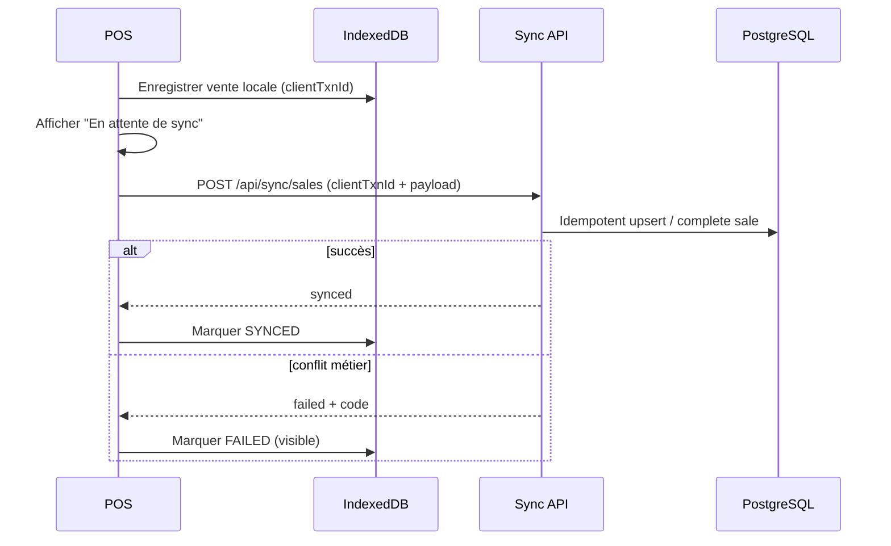

# 07 — POS, stockage offline, synchronisation

## 1. POS online

Surface dédiée, priorités : vitesse, clavier, feedback immédiat.

Flux finalisation (rappel métier) :

```text
Panier validé
  → idempotencyKey (UUID client)
  → API CompleteSale
  → transaction DB : sale + items + payments + stock + devices + credit? + warranty? + receipt + audit
  → réponse + impression / PDF
```

Stock : décrément **à la finalisation** seulement (U-09). Pas de réservation panier en MVP.

---

## 2. Périmètre offline (décidé)

**Autorisé offline :**

- lecture catalogue / clients / devices **déjà en cache local** ;
- création de ventes (immédiat ou crédit) avec UUID local ;
- file d’attente de sync.

**Interdit offline (MVP) :**

- réceptions fournisseur ;
- remboursements / retours validés ;
- ajustements stock ;
- admin users / permissions.

---

## 3. Stockage offline (ADR-0003)

| Donnée | Stockage proposé |
| --- | --- |
| Snapshot catalogue / clients / stock devices | IndexedDB |
| File des ventes en attente | IndexedDB (outbox) |
| Préférences UI légères | localStorage possible |

Service Worker (PWA) = cache d’assets / pages, **pas** la vérité des transactions.

---

## 4. Outbox & synchronisation



### Règles

| Règle | Détail |
| --- | --- |
| Identifiant client | `clientTxnId` unique (UUID) obligatoire |
| Idempotence | Même clé → même résultat, pas de doublon |
| Auth | Sync authentifiée (session ou token device — ADR-0002) |
| Conflits | Ex. IMEI déjà vendu → échec visible, résolution Manager |
| Retry | Backoff ; jamais créer une 2ᵉ vente |

Table serveur recommandée : `SyncTransaction` (clé, statut, payload hash, saleId, errors).

---

## 5. UX offline

États visibles (UX rules) :

- En ligne  
- Hors ligne  
- Synchronisation  
- Synchronisé  
- Échec de synchronisation  

Ne jamais laisser croire qu’une vente est définitive côté serveur si elle est seulement locale.
