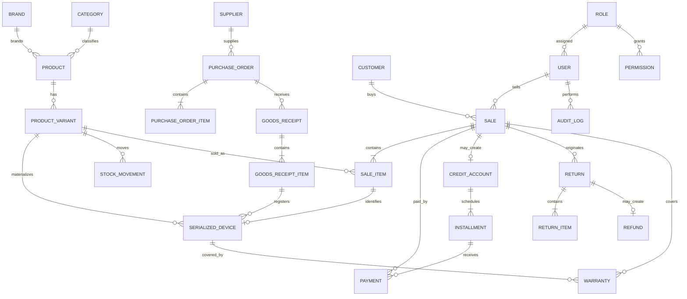

# 04 — Modèle de domaine

## 1. Concepts produit / stock

| Concept | Définition | Exemple |
| --- | --- | --- |
| **Product** | Offre commerciale | Samsung Galaxy S25 |
| **ProductVariant** | Variante vendable (SKU) | 256 Go / Noir |
| **SerializedDevice** | Unité physique traçable | IMEI + série |
| **Stock balance** | Disponibilité commerciale | Qty = somme mouvements (cache possible) |

Règle : un **Product/Variant** sérialisé n’est vendu qu’en sélectionnant un **SerializedDevice** disponible.

---

## 2. Diagramme conceptuel (ER)

---

## 3. Catalogue des entités (MVP)

| Entité | Rôle métier |
| --- | --- |
| User, Role, Permission | Accès |
| Brand, Category, Product, ProductVariant | Catalogue |
| SerializedDevice | Traçabilité unitaire |
| StockMovement | Vérité du stock |
| Supplier, PurchaseOrder, PurchaseOrderItem | Achats |
| GoodsReceipt, GoodsReceiptItem | Réception |
| Customer | Client |
| Sale, SaleItem | Vente |
| Payment | Transaction monétaire |
| CreditAccount, Installment | Crédit |
| Return, ReturnItem, Refund | Retours |
| Warranty | Garantie |
| Receipt | Document de vente |
| AuditLog | Preuve d’action |
| SyncTransaction | Synchro offline |

---

## 4. Paiement : distinguer les concepts

| Concept | Signification |
| --- | --- |
| **Payment Method** | Canal / mode déclaré (`CASH`, `ORANGE_MONEY`, `MTN_MOBILE_MONEY`) |
| **Payment Transaction** | Événement monétaire daté (montant, méthode, référence, utilisateur) |
| **Installment / Credit Account** | Engagement de paiement échelonné lié à une vente |
| **Installment Payment** | Payment Transaction affecté à une échéance / au solde crédit |

`INSTALLMENT` au checkout signifie : « cette vente crée un **CreditAccount** » ; l’acompte initial est une ou plusieurs **Payment Transactions** immédiates.

### Exemple multi-paiements (vente immédiate)

Total 600 000 FCFA :

- 200 000 CASH
- 150 000 ORANGE_MONEY
- 250 000 MTN_MOBILE_MONEY

Somme des paiements = total ; pas de crédit.

### Exemple crédit

Total 600 000 ; acompte 200 000 CASH ; reste 400 000 sur 4 échéances de 100 000.

---

## 5. Montants

- Devise : **XAF / FCFA**
- Représentation : **entier en unités FCFA** ou `NUMERIC` exact — **jamais** float
- Prix de vente stockés **TTC** (`BR-PRODUCT-005`)
- Pas de moteur de TVA complexe en MVP

---

## 6. Identifiants techniques vs métier

| Type | Exemple | Usage |
| --- | --- | --- |
| ID technique | UUID | Clé primaire, synchro |
| Référence métier | `V-2026-000124` | UI, reçu, recherche humaine |

Documents à numéroter (métier) :

- Vente, Reçu, Commande achat, Réception, Retour, Garantie, Compte crédit

Format exact des préfixes : **configurable** dans Settings (détail technique en phase DB).

---

## 7. Suppression des données

| Catégorie | Règle |
| --- | --- |
| Ventes, paiements, mouvements, audits, crédits | **Pas de suppression physique silencieuse** |
| Produits, clients, fournisseurs, users | **Désactivation / soft delete** préférée |
| Brouillons (commande DRAFT non utilisée) | Suppression possible si jamais activée |

---

## 8. Réservation de stock (POS)

`project-context` liste `RESERVATION` / `RESERVATION_RELEASE`.

**Décidé (U-09) :**

- MVP : décrément de stock **à la finalisation atomique** uniquement.
- Réservation explicite de panier (`RESERVATION` / `RESERVATION_RELEASE`) = **V1**.
