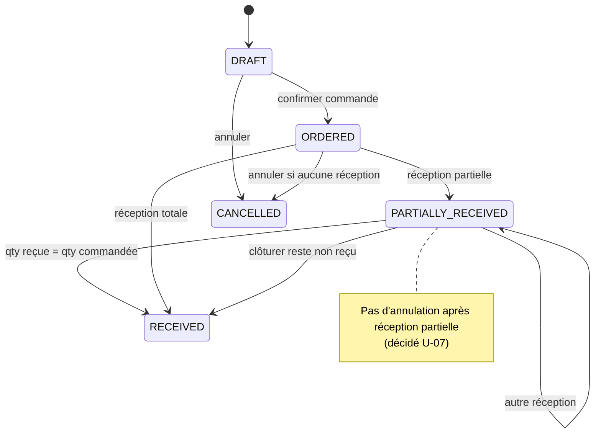
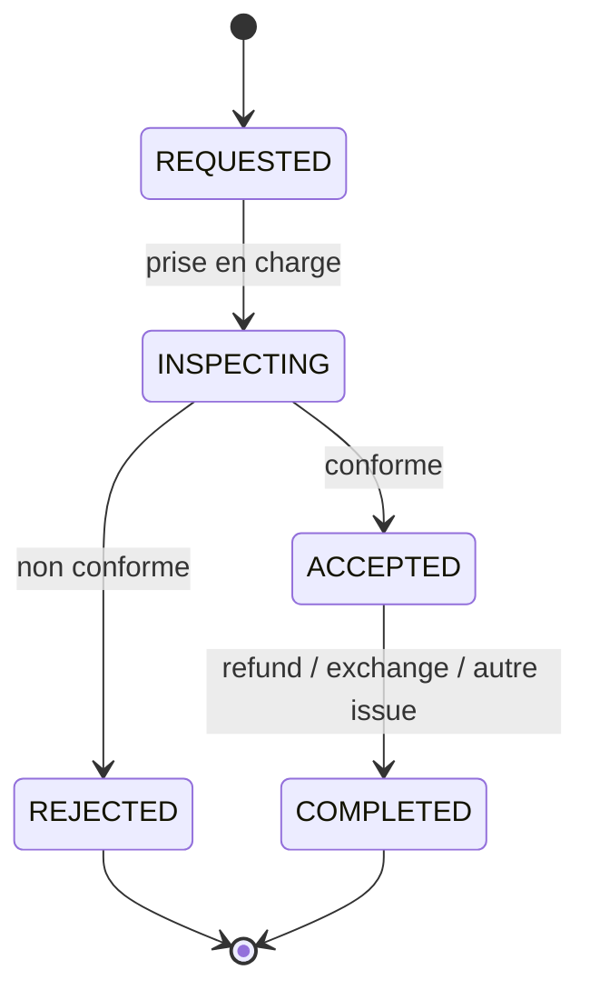
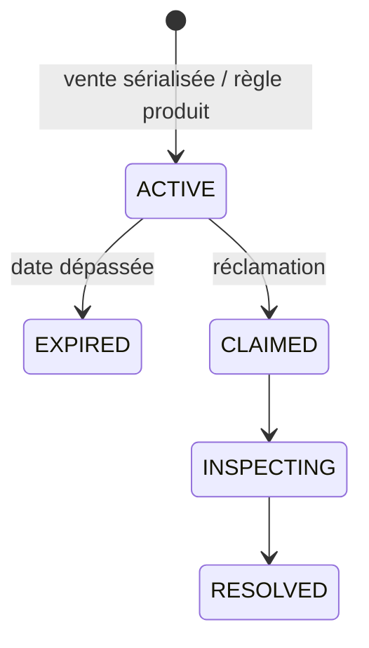

# 05 — Processus métier

## 1. Achat fournisseur → réception



### Règles clés

- Réception crée `GoodsReceipt` + `StockMovement(PURCHASE_RECEIPT)`.
- Produits sérialisés : saisie IMEI/série à la réception ; unicité DB (`BR-PRODUCT-003/004`).
- **Sur-réception interdite** en MVP (`BR-PURCHASE-002`).
- Coût d’achat enregistré sur lignes / réception (base de marge).

---

## 2. Vente POS (paiement immédiat)

```mermaid
flowchart TD
    A[Recherche produit / IMEI] --> B[Panier]
    B --> C{Remise?}
    C -->|oui| D[Contrôle permission + plafond]
    C -->|non| E[Client optionnel]
    D --> E
    E --> F[Saisie paiement(s)]
    F --> G{Somme paiements = total?}
    G -->|non| F
    G -->|oui| H[Finalisation atomique]
    H --> I[Sale + Items + Payments + StockMovements + Device status + Audit + Receipt]
```

### Atomicité (`BR-SALE-002`)

En une transaction :

1. Sale + SaleItems  
2. Payment(s)  
3. StockMovement(SALE)  
4. MAJ SerializedDevice → SOLD  
5. Audit  
6. Receipt  

Idempotence via identifiant unique de transaction (`BR-SALE-003`, crucial offline).

---

## 3. Vente à crédit (installments)

```mermaid
flowchart TD
    A[Panier + Client obligatoire] --> B[Choisir mode INSTALLMENT]
    B --> C[Définir acompte min configurable > 0 + plan d'échéances]
    C --> D[Paiement(s) acompte]
    D --> E[Créer Sale + CreditAccount + Installments]
    E --> F[Mouvements stock + devices]
    F --> G[Paiements ultérieurs sur échéances]
    G --> H[MAJ soldes / statuts]
```

États crédit : voir `06-states-transitions.md`.  
Pas d’intérêts / pénalités tant que non définis.

---

## 4. Paiement d’échéance

1. Sélectionner client / crédit  
2. Choisir échéance(s) ou imputation au solde  
3. Enregistrer Payment Transaction (CASH / OM / MTN)  
4. Recalculer soldes + statuts  
5. Audit  

**Surpaiement :** refusé (`BR-PAYMENT-004`) sauf politique future.

---

## 5. Retour client



Effets si accepté (selon issue) :

| Issue | Stock | Argent | Crédit | Device |
| --- | --- | --- | --- | --- |
| Remboursement | + si remis en vente | Refund ≤ remboursable | ajuster si besoin | statut retour |
| Échange | - nouvel article / + ancien | éventuel complément | — | nouveaux liens |
| Avoir magasin | selon cas | **V1** (décidé U-05) | — | — |

Retour ≠ annulation vente : **nouvel événement** lié à la vente d’origine (`BR-RETURN-001`).

---

## 6. Garantie



Validité : date courante ∈ [start, end] et appareil/vente associés (`BR-WARRANTY-*`).

---

## 7. Ajustement de stock

1. Permission `inventory.adjust`  
2. Quantité delta + motif obligatoire  
3. `StockMovement(STOCK_ADJUSTMENT | DAMAGED | LOST | …)`  
4. Audit (`BR-INVENTORY-006`)

---

## 8. Offline POS (métier)

**Autorisé offline (MVP recommandé) :**

- Recherche catalogue / clients **déjà synchronisés localement**
- Création vente (immédiat ou crédit) avec UUID client-side
- Sélection device localement disponible
- Persistance locale + file de sync

**Interdit / différé online :**

- Ajustements stock majeurs
- Remboursements
- Admin users / permissions
- Réceptions fournisseur (**décidé**, hypothèse C.4 : online only en MVP)

Contraintes : idempotence, pas de double vente du même IMEI, échecs de sync **visibles** (`BR-OFFLINE-*`).
