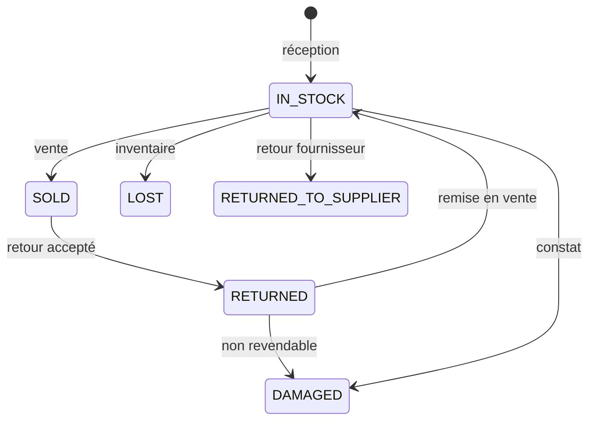

# 06 — États et transitions

Légende colonnes : **Depuis → Vers** | Déclencheur | Acteur typique | Effets | Interdit si

---

## 1. Product / ProductVariant

| États | Transitions |
| --- | --- |
| `DRAFT` (optionnel) → `ACTIVE` → `INACTIVE` | Activation catalogue / désactivation |

- Vente interdite si `INACTIVE` / non vendable.
- Pas de suppression physique si historique de ventes.

---

## 2. SerializedDevice

| État | Signification |
| --- | --- |
| `IN_STOCK` | Disponible à la vente |
| `RESERVED` | V1 (si réservation) |
| `SOLD` | Vendu à un client |
| `RETURNED` | Revenu client (puis éventuellement `IN_STOCK` ou `DAMAGED`) |
| `DAMAGED` | Hors vente |
| `RETURNED_TO_SUPPLIER` | Renvoyé fournisseur |
| `LOST` | Perte inventaire |

Transitions critiques :

- `IN_STOCK` → `SOLD` : finalisation vente (1 seule fois)
- `SOLD` → `RETURNED` : retour accepté
- Interdit : vendre un device non `IN_STOCK` (`BR-INVENTORY-007`)

---

## 3. PurchaseOrder

`DRAFT` → `ORDERED` → `PARTIALLY_RECEIVED` → `RECEIVED`  
ou `CANCELLED` uniquement si **aucune** réception (décidé U-07 : pas d’annulation après réception partielle ; clôturer le reste)

---

## 4. GoodsReceipt

| État | Notes |
| --- | --- |
| `DRAFT` | Saisie en cours |
| `POSTED` | Validée → mouvements stock créés |
| `CANCELLED` | Seulement avant posting ; après = correction compensatoire |

---

## 5. Sale

| État | Signification |
| --- | --- |
| `DRAFT` | Panier non finalisé (local / session) |
| `COMPLETED` | Finalisée |
| `CANCELLED` | Annulation **avant** completion uniquement |
| `PARTIALLY_RETURNED` | Retour partiel post-vente |
| `RETURNED` | Retour total |

**Après `COMPLETED` :** pas d’« effacement » ; utiliser Return / Refund.

---

## 6. Payment

| État | Notes |
| --- | --- |
| `COMPLETED` | Enregistré |
| `VOIDED` | **Non autorisé en MVP** (décidé U-08) ; préférer un refund compensatoire |

Montant : positif sauf refund explicite (`BR-PAYMENT-002`).

---

## 7. CreditAccount

### Décision actée (A1)

| Source | Statuts |
| --- | --- |
| `project-context.md` | `PAID`, `PARTIALLY_PAID`, `PENDING`, `OVERDUE` |
| `prompt_001` | `ACTIVE`, `PARTIALLY_PAID`, `OVERDUE`, `PAID`, `DEFAULTED`, `CANCELLED` |

**MVP — statuts autorisés :**

| Statut | Définition |
| --- | --- |
| `PENDING` | Créé sans encaissement (solde = total ; cas limite / seed) |
| `PARTIALLY_PAID` | Au moins un encaissement (acompte ou échéance) et solde > 0 |
| `OVERDUE` | Au moins une échéance impayée dépassée |
| `PAID` | Solde = 0 |

`ACTIVE` reste dans l’enum Prisma pour compatibilité historique / seed ancien, mais **n’est plus dérivé** en MVP (équivalent historique de `PENDING` sans acompte).

**V1 uniquement :** `DEFAULTED`, `CANCELLED`.

**Règle de dérivation du statut courant (MVP) :**

1. si solde = 0 → `PAID`  
2. sinon si échéance en retard → `OVERDUE`  
3. sinon si solde < total (acompte ou paiements d’échéances) → `PARTIALLY_PAID`  
4. sinon → `PENDING`  

---

## 8. Installment (échéance)

| État | Définition |
| --- | --- |
| `DUE` | À payer, pas encore due date passée sans paiement |
| `PARTIAL` | Paiement partiel sur l’échéance |
| `PAID` | Soldée |
| `OVERDUE` | Date dépassée, reste dû > 0 |
| `CANCELLED` | Plan annulé — **V1** (lié au crédit `CANCELLED`) |

---

## 9. Return

`REQUESTED` → `INSPECTING` → `ACCEPTED` | `REJECTED` → (`COMPLETED` si accepté après issue)

---

## 10. Warranty

`ACTIVE` → `CLAIMED` → `INSPECTING` → `RESOLVED`  
`ACTIVE` → `EXPIRED`

---

## 11. StockMovement

Événement **immuable** une fois posté.

Types MVP :

- `PURCHASE_RECEIPT`
- `SALE`
- `CUSTOMER_RETURN`
- `SUPPLIER_RETURN`
- `STOCK_ADJUSTMENT`
- `DAMAGED`
- `LOST`

Correction = **nouveau mouvement inverse**, pas edit in-place.

---

## 12. User

`ACTIVE` ↔ `DISABLED`  
Pas de suppression physique si audit / ventes liés.
