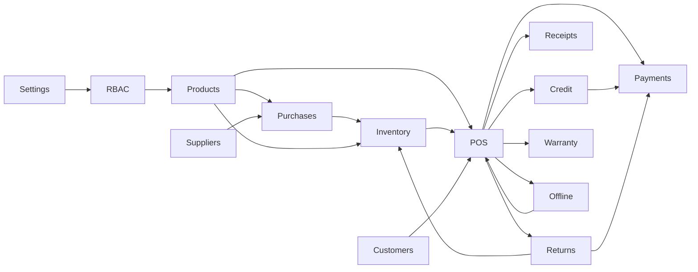

# 11 — Dépendances entre modules

## Matrice

| Module | Dépend de |
| --- | --- |
| Settings | — (socle) |
| Users / RBAC / Audit | Settings |
| Products | Settings, Users |
| Suppliers | Users |
| Purchases | Products, Suppliers, Users |
| Inventory | Products, Purchases (réceptions), Users |
| Customers | Users |
| Payments | Users, Settings |
| Sales / POS | Products, Inventory, Customers, Payments, Users, Settings |
| Credit | Sales, Customers, Payments |
| Returns | Sales, Inventory, Payments, Credit (si solde), Users |
| Warranty | Sales, Customers, Products / Serialized Devices |
| Receipts | Sales, Payments, Warranty (infos) |
| Offline Sync | Sales, Payments, Inventory, Credit |
| Dashboard | Sales, Inventory, Payments, Credit, Products |
| Reports | Presque tous |

---

## Ordre de construction recommandé (pour phases suivantes)

```text
1. Settings + Users/RBAC
2. Products (+ Brands/Categories)
3. Suppliers + Purchases + Goods Receipt → Inventory movements
4. Customers
5. Sales/POS + Payments + Receipts
6. Credit / Installments
7. Returns + Warranty
8. Dashboard / Reports
9. Offline Sync hardening
10. Audit completeness pass
```

---

## Graphe simplifié


